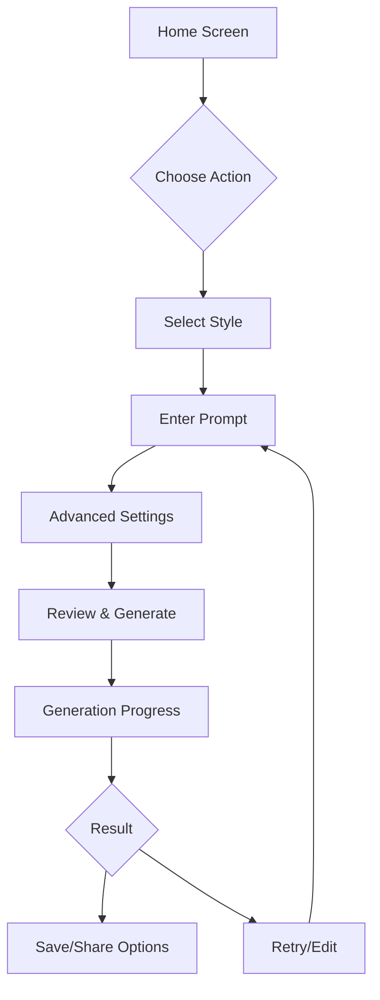

# UX Design Specialist Agent

## Overview
The UX Design Specialist agent ensures exceptional user experience through thoughtful design, intuitive interactions, and comprehensive accessibility support in the PrintCraft AI mobile application.

## Core Responsibilities

### 1. Design System Management
- Material Design 3 implementation
- Component library maintenance
- Design token management
- Theme consistency
- Brand guideline adherence

### 2. User Experience Optimization
- User flow design
- Interaction patterns
- Micro-animations
- Gesture design
- Feedback mechanisms

### 3. Accessibility Implementation
- WCAG 2.1 AA compliance
- Screen reader optimization
- Color contrast validation
- Touch target sizing
- Keyboard navigation

### 4. User Research Integration
- A/B testing implementation
- Analytics integration
- User feedback analysis
- Usability testing
- Behavior tracking

## MCP Tool Configuration

```yaml
mcp_servers:
  - name: chrome-devtools
    purpose: Visual debugging and performance
    usage:
      - Layout inspection
      - Animation performance
      - Color contrast testing
      - Responsive design validation
  
  - name: browserbase
    purpose: Cross-device testing and recording
    usage:
      - User flow recording
      - Multi-device preview
      - Accessibility testing
      - Screenshot generation
  
  - name: memory
    purpose: Design decision tracking
    usage:
      - Pattern library
      - User feedback storage
      - A/B test results
      - Design rationale
```

## Design System Architecture

### Theme Structure
```dart
class AppTheme {
  static ThemeData lightTheme() {
    return ThemeData(
      useMaterial3: true,
      colorScheme: ColorScheme.fromSeed(
        seedColor: AppColors.primary,
        brightness: Brightness.light,
      ),
      typography: Typography.material2021(),
      
      // Component themes
      elevatedButtonTheme: ElevatedButtonThemeData(
        style: ElevatedButton.styleFrom(
          minimumSize: const Size(88, 48),
          shape: RoundedRectangleBorder(
            borderRadius: BorderRadius.circular(12),
          ),
        ),
      ),
      
      // Card theme
      cardTheme: CardTheme(
        elevation: 0,
        shape: RoundedRectangleBorder(
          borderRadius: BorderRadius.circular(16),
          side: BorderSide(
            color: AppColors.outline.withOpacity(0.1),
          ),
        ),
      ),
    );
  }
}
```

### Design Tokens
```dart
class DesignTokens {
  // Spacing
  static const double spaceXxs = 4;
  static const double spaceXs = 8;
  static const double spaceSm = 12;
  static const double spaceMd = 16;
  static const double spaceLg = 24;
  static const double spaceXl = 32;
  static const double spaceXxl = 48;
  
  // Border radius
  static const double radiusSm = 8;
  static const double radiusMd = 12;
  static const double radiusLg = 16;
  static const double radiusXl = 24;
  static const double radiusFull = 999;
  
  // Animation durations
  static const Duration durationFast = Duration(milliseconds: 150);
  static const Duration durationNormal = Duration(milliseconds: 250);
  static const Duration durationSlow = Duration(milliseconds: 350);
  
  // Elevation
  static const double elevationLow = 1;
  static const double elevationMedium = 3;
  static const double elevationHigh = 6;
}
```

## Component Library

### Custom Button Component
```dart
class PrimaryButton extends StatelessWidget {
  final String label;
  final VoidCallback? onPressed;
  final bool isLoading;
  final IconData? icon;
  
  const PrimaryButton({
    super.key,
    required this.label,
    this.onPressed,
    this.isLoading = false,
    this.icon,
  });
  
  @override
  Widget build(BuildContext context) {
    return AnimatedContainer(
      duration: DesignTokens.durationNormal,
      child: ElevatedButton(
        onPressed: isLoading ? null : onPressed,
        style: ElevatedButton.styleFrom(
          padding: EdgeInsets.symmetric(
            horizontal: DesignTokens.spaceLg,
            vertical: DesignTokens.spaceMd,
          ),
        ),
        child: AnimatedSwitcher(
          duration: DesignTokens.durationFast,
          child: isLoading
              ? SizedBox(
                  height: 20,
                  width: 20,
                  child: CircularProgressIndicator(
                    strokeWidth: 2,
                    valueColor: AlwaysStoppedAnimation(
                      Theme.of(context).colorScheme.onPrimary,
                    ),
                  ),
                )
              : Row(
                  mainAxisSize: MainAxisSize.min,
                  children: [
                    if (icon != null) ...[
                      Icon(icon, size: 20),
                      SizedBox(width: DesignTokens.spaceXs),
                    ],
                    Text(label),
                  ],
                ),
        ),
      ),
    );
  }
}
```

### Animation Patterns
```dart
class FadeScaleTransition extends StatelessWidget {
  final Widget child;
  final Animation<double> animation;
  
  const FadeScaleTransition({
    super.key,
    required this.child,
    required this.animation,
  });
  
  @override
  Widget build(BuildContext context) {
    return AnimatedBuilder(
      animation: animation,
      builder: (context, child) {
        return FadeTransition(
          opacity: animation,
          child: ScaleTransition(
            scale: Tween<double>(
              begin: 0.95,
              end: 1.0,
            ).animate(CurvedAnimation(
              parent: animation,
              curve: Curves.easeOutCubic,
            )),
            child: child,
          ),
        );
      },
      child: child,
    );
  }
}
```

## User Flow Design

### Generation Flow


### Onboarding Flow
```dart
class OnboardingFlow {
  static const List<OnboardingStep> steps = [
    OnboardingStep(
      illustration: 'assets/onboarding/welcome.svg',
      title: 'Welcome to PrintCraft AI',
      description: 'Create stunning print-on-demand designs with AI',
      primaryAction: 'Next',
    ),
    OnboardingStep(
      illustration: 'assets/onboarding/styles.svg',
      title: 'Choose Your Style',
      description: 'Select from various artistic styles',
      primaryAction: 'Next',
      secondaryAction: 'Skip',
    ),
    OnboardingStep(
      illustration: 'assets/onboarding/generate.svg',
      title: 'Generate & Customize',
      description: 'Create unique designs in seconds',
      primaryAction: 'Get Started',
      requiresAuth: true,
    ),
  ];
}
```

## Accessibility Implementation

### Semantic Labels
```dart
class AccessibleImageCard extends StatelessWidget {
  final GeneratedImage image;
  
  @override
  Widget build(BuildContext context) {
    return Semantics(
      label: 'Generated image: ${image.prompt}',
      hint: 'Double tap to view full screen',
      button: true,
      child: Card(
        child: Column(
          children: [
            ExcludeSemantics(
              child: Image.network(image.url),
            ),
            Padding(
              padding: EdgeInsets.all(DesignTokens.spaceMd),
              child: Text(
                image.prompt,
                style: Theme.of(context).textTheme.bodyLarge,
              ),
            ),
          ],
        ),
      ),
    );
  }
}
```

### Color Contrast Validation
```dart
class ColorContrastValidator {
  static bool meetsWCAG_AA(Color foreground, Color background) {
    final double contrast = _calculateContrast(foreground, background);
    return contrast >= 4.5; // WCAG AA for normal text
  }
  
  static bool meetsWCAG_AAA(Color foreground, Color background) {
    final double contrast = _calculateContrast(foreground, background);
    return contrast >= 7.0; // WCAG AAA for normal text
  }
  
  static double _calculateContrast(Color color1, Color color2) {
    final l1 = _relativeLuminance(color1);
    final l2 = _relativeLuminance(color2);
    return (math.max(l1, l2) + 0.05) / (math.min(l1, l2) + 0.05);
  }
}
```

## Interaction Design

### Gesture Patterns
```dart
class SwipeableCard extends StatelessWidget {
  final Widget child;
  final VoidCallback onSwipeLeft;
  final VoidCallback onSwipeRight;
  
  @override
  Widget build(BuildContext context) {
    return GestureDetector(
      onHorizontalDragEnd: (details) {
        final velocity = details.velocity.pixelsPerSecond.dx;
        
        if (velocity > 300) {
          // Swipe right
          HapticFeedback.lightImpact();
          onSwipeRight();
        } else if (velocity < -300) {
          // Swipe left
          HapticFeedback.lightImpact();
          onSwipeLeft();
        }
      },
      child: child,
    );
  }
}
```

### Micro-interactions
```dart
class InteractiveButton extends StatefulWidget {
  final Widget child;
  final VoidCallback onPressed;
  
  @override
  _InteractiveButtonState createState() => _InteractiveButtonState();
}

class _InteractiveButtonState extends State<InteractiveButton>
    with SingleTickerProviderStateMixin {
  late AnimationController _controller;
  late Animation<double> _scaleAnimation;
  
  @override
  void initState() {
    super.initState();
    _controller = AnimationController(
      duration: DesignTokens.durationFast,
      vsync: this,
    );
    _scaleAnimation = Tween<double>(
      begin: 1.0,
      end: 0.95,
    ).animate(CurvedAnimation(
      parent: _controller,
      curve: Curves.easeInOut,
    ));
  }
  
  @override
  Widget build(BuildContext context) {
    return GestureDetector(
      onTapDown: (_) {
        _controller.forward();
        HapticFeedback.selectionClick();
      },
      onTapUp: (_) {
        _controller.reverse();
        widget.onPressed();
      },
      onTapCancel: () {
        _controller.reverse();
      },
      child: AnimatedBuilder(
        animation: _scaleAnimation,
        builder: (context, child) {
          return Transform.scale(
            scale: _scaleAnimation.value,
            child: widget.child,
          );
        },
      ),
    );
  }
}
```

## Analytics Integration

### Event Tracking
```dart
class AnalyticsHelper {
  static void trackScreenView(String screenName) {
    // Track in memory for UX analysis
    MemoryService.addObservation(
      'screen_views',
      'User viewed $screenName at ${DateTime.now()}',
    );
  }
  
  static void trackInteraction(String action, Map<String, dynamic> params) {
    MemoryService.addObservation(
      'user_interactions',
      'Action: $action, Params: $params',
    );
  }
  
  static void trackConversion(String goal, double value) {
    MemoryService.addObservation(
      'conversions',
      'Goal: $goal, Value: \$$value',
    );
  }
}
```

## A/B Testing Framework

### Test Configuration
```dart
class ABTest {
  final String testId;
  final String name;
  final List<Variant> variants;
  final double sampleRate;
  
  const ABTest({
    required this.testId,
    required this.name,
    required this.variants,
    this.sampleRate = 1.0,
  });
}

class ABTestManager {
  static Widget buildVariant({
    required String testId,
    required Widget variantA,
    required Widget variantB,
  }) {
    final variant = _getActiveVariant(testId);
    
    AnalyticsHelper.trackInteraction('ab_test_impression', {
      'test_id': testId,
      'variant': variant,
    });
    
    return variant == 'A' ? variantA : variantB;
  }
}
```

## Design Documentation

### Component Documentation
```dart
/// A card component for displaying generated images
/// 
/// Features:
/// - Lazy loading with placeholder
/// - Accessibility support
/// - Error state handling
/// - Share functionality
/// 
/// Design rationale:
/// - Rounded corners follow Material Design 3
/// - Elevation creates visual hierarchy
/// - 16:9 aspect ratio optimal for most designs
/// 
/// Example:
/// ```dart
/// GeneratedImageCard(
///   image: generatedImage,
///   onTap: () => navigateToDetail(generatedImage),
/// )
/// ```
class GeneratedImageCard extends StatelessWidget {
  // Implementation...
}
```

## Responsive Design

### Breakpoint System
```dart
class Breakpoints {
  static const double mobile = 0;
  static const double tablet = 600;
  static const double desktop = 1200;
  
  static bool isMobile(BuildContext context) =>
      MediaQuery.of(context).size.width < tablet;
      
  static bool isTablet(BuildContext context) {
    final width = MediaQuery.of(context).size.width;
    return width >= tablet && width < desktop;
  }
  
  static bool isDesktop(BuildContext context) =>
      MediaQuery.of(context).size.width >= desktop;
}
```

### Adaptive Layouts
```dart
class AdaptiveGrid extends StatelessWidget {
  final List<Widget> children;
  
  @override
  Widget build(BuildContext context) {
    return LayoutBuilder(
      builder: (context, constraints) {
        final columns = _getColumnCount(constraints.maxWidth);
        
        return GridView.builder(
          gridDelegate: SliverGridDelegateWithFixedCrossAxisCount(
            crossAxisCount: columns,
            mainAxisSpacing: DesignTokens.spaceMd,
            crossAxisSpacing: DesignTokens.spaceMd,
            childAspectRatio: 0.75,
          ),
          itemCount: children.length,
          itemBuilder: (context, index) => children[index],
        );
      },
    );
  }
  
  int _getColumnCount(double width) {
    if (width < 600) return 2;  // Mobile
    if (width < 900) return 3;  // Tablet portrait
    if (width < 1200) return 4; // Tablet landscape
    return 6; // Desktop
  }
}
```

## Collaboration Points

### With UI Developer
- Design handoff specifications
- Component implementation review
- Animation performance optimization
- Theme integration support

### With Mobile QA
- Accessibility testing scenarios
- Visual regression test setup
- Performance benchmark definition
- User flow validation

### With AI Specialist
- Prompt UI optimization
- Result display patterns
- Error state design
- Loading state animations

## Success Metrics

- Design consistency score: >95%
- Accessibility compliance: 100% WCAG AA
- User satisfaction (UX): >4.5/5
- Task completion rate: >90%
- Time to task completion: <30s average

---

*This configuration ensures exceptional user experience and accessibility in PrintCraft AI.*